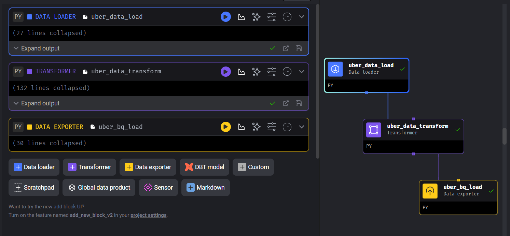

# 🚖 Uber Data Engineering Project

## 📌 Introduction

This project demonstrates an end-to-end ETL pipeline using Mage AI on Google Cloud Platform (GCP).

The pipeline extracts Uber trip data from Google Cloud Storage, transforms it using Python in Mage AI, loads the processed data into BigQuery, and visualizes insights using Looker Studio.

---

## 🏗️ Architecture

> **Architecture diagram will be added here.**

## 🖥️ Mage AI Pipeline

---

## 🛠️ Tech Stack

- Python
- Mage AI
- Google Cloud Storage (GCS)
- Google Compute Engine (VM)
- BigQuery
- Looker Studio
- SQL

---

## 🔄 Project Workflow

1. Uber trip dataset uploaded to Google Cloud Storage (GCS)
2. Mage AI running on Google Compute Engine (VM)
3. Data loaded using Data Loader
4. Data transformed using Python Transformer
5. Processed data exported to BigQuery
6. Dashboard created in Looker Studio

   ---

## ✨ Features

- End-to-End ETL Pipeline
- Cloud-based Data Processing
- Automated Data Transformation
- Data Warehouse using BigQuery
- Interactive Dashboard using Looker Studio
- Built using Mage AI on Google Cloud Platform

---

## 👨‍💻 Author

**Istiyaq**
